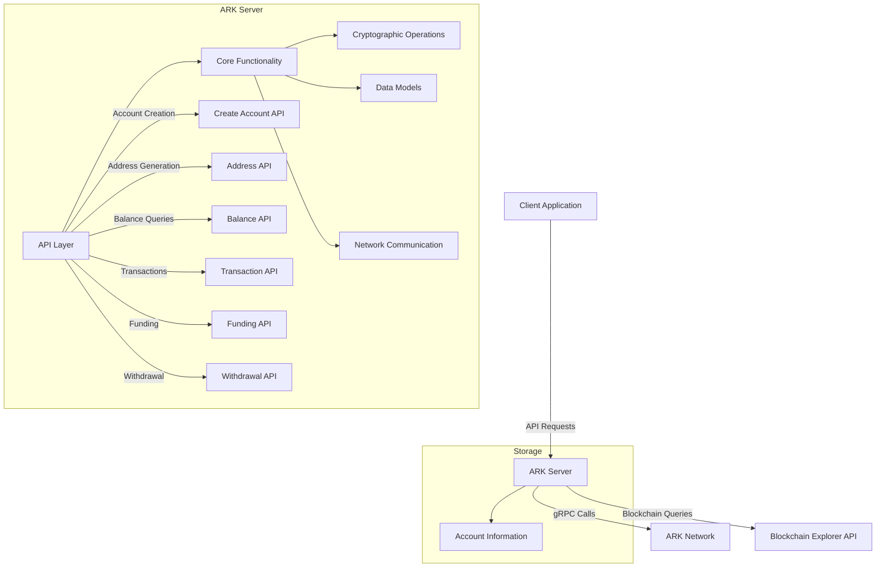
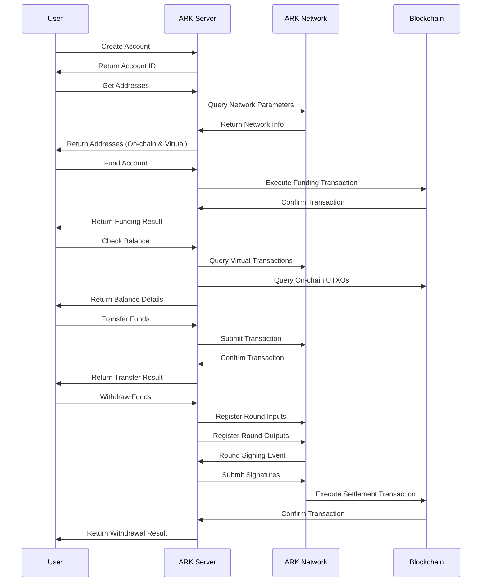

# ARK Wallet - Backend Server

A cryptocurrency wallet server implementation that supports both on-chain and off-chain transactions using ARK protocol.

## Project Overview

ARK Wallet is a cryptocurrency wallet server built on Rust that provides a complete API for managing crypto assets through the ARK (Advanced Routing for Krypto) protocol. The server enables users to create accounts, manage addresses, check balances, send transactions, and handle both on-chain and off-chain (virtual) transactions.

## System Architecture

The following diagram illustrates the high-level architecture and workflow of the ARK Wallet system:



### Transaction Flow

The following diagram shows the flow of a transaction in the ARK Wallet system:



## Architecture

The backend server has been restructured into a clean, modular design with the following components:

### Core Components

- **main.rs**: Entry point that initializes the application and starts the server
- **core.rs**: Central module containing data models, utility functions, and server configuration
- **api.rs**: API endpoints implementation divided into logical modules

### API Endpoints

#### Account Management
- `POST /api/accounts`: Create a new account with unique ID and cryptographic keys
- `GET /api/accounts/{account_id}/addresses`: Retrieve on-chain and virtual addresses for an account

#### Financial Operations
- `GET /api/accounts/{account_id}/balance`: Get account balance information
- `POST /api/transfer`: Transfer funds between accounts
- `POST /api/fund`: Fund an account with on-chain assets
- `POST /api/withdraw`: Withdraw funds to an external address

## Technical Details

### Key Features

1. **Dual-Address System**
   - On-chain address (boarding output) for Bitcoin network transactions
   - Virtual address (VTXO) for off-chain, faster transactions

2. **Balance Management**
   - On-chain balance tracking (spendable, expired, pending)
   - Virtual balance tracking (spendable, expired)

3. **Transaction Processing**
   - Secure transaction signing using Schnorr signatures
   - Support for multi-signature schemes
   - Transaction fee optimization

4. **Network Communication**
   - gRPC communication with ARK network
   - Esplora API integration for blockchain queries

### Security Features

- Private key isolation and protection
- Cryptographic signature verification
- Secure transaction building and validation

## Implementation Details

### Data Models

The system uses a comprehensive set of data models to represent accounts, transactions, and balances:

```rust
// Core account model
struct UserAccount {
    id: String,
    private_key: String,
}

// Application state management
struct ApplicationState {
    accounts: Mutex<HashMap<String, UserAccount>>,
    config: config::AppConfig,
    server_connection: Option<Mutex<ark_core::server::Info>>,
    blockchain_client: Option<Mutex<BlockchainClient>>,
}

// Balance representation
struct BalanceDetails {
    account_id: String,
    virtual_balance: VirtualBalance,
    onchain_balance: OnchainBalance,
}
```

### API Implementation

The API is implemented using the Actix Web framework with asynchronous handling of requests:

```rust
#[post("/api/accounts")]
pub async fn create_account(state: web::Data<ApplicationState>) -> impl Responder {
    // Generate cryptographic keys
    // Create unique identifier
    // Store account
    // Return response
}

#[get("/api/accounts/{account_id}/addresses")]
pub async fn get_account_addresses(
    account_id: web::Path<String>,
    state: web::Data<ApplicationState>,
) -> impl Responder {
    // Retrieve account
    // Generate addresses
    // Return addresses
}
```

### Transaction Handling

Transactions are processed through a multi-step flow:

1. Input selection and coin selection
2. Transaction building
3. Cryptographic signing
4. Network submission
5. Confirmation handling

## Dependencies

The server relies on several key dependencies:

- `actix-web`: Web framework for API endpoints
- `bitcoin`: Bitcoin protocol implementation
- `esplora-client`: Blockchain explorer API client
- `ark-core`, `ark-grpc`: ARK protocol implementation
- `serde`: Serialization/deserialization
- `tokio`: Asynchronous runtime

## Implementation Notes

- The server uses an in-memory database for account storage in the current implementation
- Cryptographic operations are handled using the Secp256k1 library with Schnorr signatures
- The system supports both Bitcoin testnet and mainnet configurations
- Error handling provides detailed feedback for client applications

## Configuration

The server is configured through the `ark.config.toml` file which contains:

```toml
ark_server_url = "http://localhost:7070"
esplora_url = "http://localhost:30000"
```

## Future Improvements

- Persistent database storage for accounts
- Additional API endpoints for transaction history
- Enhanced error handling and logging
- Performance optimization for high-volume transactions
- Hardware wallet integration